# Event-Driven Substrate Architecture

This document outlines the topology and data flow of the real-time Event-Driven Substrate. The architecture is built around event-driven microservices, Apache Flink for stream processing, Redpanda for the message broker, and ClickHouse for Real-Time OLAP.

## Architecture & Data Flow Diagram

## Zero Trust Kafka Authentication (SASL/SCRAM)

Every service authenticates to Redpanda with its own SASL/SCRAM-SHA-256 identity and is granted least-privilege ACLs. No anonymous Kafka connections are permitted.

### Service Identity Matrix

| Identity | Service | Topic Access |
|----------|---------|-------------|
| `superuser` | Redpanda admin (rpk, topic creation) | All (ACL bypass) |
| `api-gateway` | Go HTTP→Kafka producer | Write `public.*` |
| `flink-processor` | Flink SQL stream processing | Read `public.*`, Read/Write `internal.*` |
| `message-consumer` | Go Kafka→Postgres egress | Read `public.*` |
| `schema-admin` | Confluent Schema Registry | Read/Write/Create/Alter `_schemas` |
| `clickhouse-consumer` | ClickHouse OLAP ingestion | Read `internal.*` |

### Topic Boundary Enforcement

Topics are divided into two security zones enforced by prefixed ACLs:

- **`public.*`** — Validated data products. The API Gateway writes; Flink, message-consumer, and ClickHouse read.
- **`internal.*`** — Derived changelogs, state, and joins. Only Flink (read/write) and ClickHouse (read) have access. The API Gateway is explicitly denied.

### Bootstrap Sequence

1. Redpanda starts with `enable_sasl: true` in `redpanda-bootstrap.yaml` (cluster-level property).
2. The `redpanda-auth-init` Docker service creates all 6 SCRAM users via the unauthenticated Admin API (port 9644), waits for credential propagation, then applies ACLs via the Kafka protocol authenticating as `superuser`.
3. Schema Registry starts only after auth-init completes, authenticating as `schema-admin`.
4. All downstream services (Go, Flink, ClickHouse) authenticate with their respective identities.

### Production Path

The env-var-driven design (`KAFKA_SASL_MECHANISM`, `KAFKA_SASL_USERNAME`, `KAFKA_SASL_PASSWORD`) means swapping to OAUTHBEARER (GCP/AWS) is a configuration change — no code changes needed.

---

## Data Flow Summary

1. **Authentication**: The `Vite Frontend` sends user credentials to `Supabase Auth`. (Signouts delete the `auth.sessions` row directly).
2. **Internal Ingress (Webhooks)**: Upon a successful login/signup/signout, a PostgreSQL trigger in the associated auth table (`auth.users` or `auth.sessions`) fires a `pg_net` webhook (`POST /webhooks/{topic}`) statically authenticated via an `X-Webhook-Secret`.
3. **External Ingress (Clients)**: The `Vite Frontend` can also send custom telemetry directly to the gateway (`POST /api/v1/events/{topic}`), which is cryptographically authenticated via Supabase JWTs.
4. **Dynamic Topic Allowlisting**: The Gateway strictly limits topic injection via a native Kubernetes `ConfigMap` volume mount (`routes.yaml`) watched by a Viper `fsnotify` daemon for zero-downtime hot-reloading.
5. **Serialization (Go)**: Once routing is approved, the Gateway dynamically fetches schema definitions from the `Schema Registry` and serializes the payload into binary `Avro` format, then produces to `Redpanda` authenticating as `api-gateway` via SASL/SCRAM-SHA-256.
6. **Stream Processing (Flink)**: Flink Kubernetes pods authenticate as `flink-processor` and consume the raw Avro events.
   - Kafka source tables are registered centrally by `sql_runner.py` — individual SQL files only define JDBC sinks and INSERT logic. Distinct domain processors (`login_events_processor`, `signup_events_processor`, `signout_events_processor`) read from their respective centrally-registered tables and write to the unified `user_notifications` table with a `{domain}.{entity}` event type (e.g. `identity.login`) and a JSON `payload` TEXT column. This enables the frontend to subscribe to a single Supabase Realtime channel.
   - A unifying processor (`unified_events_processor`) continuously runs a `UNION ALL` across multiple domain topics, casting them to a standard `PlatformEvent` schema and streaming them onto a unified Kafka topic for analytics and the data lake.
7. **Auto-Scaling Consumers (KEDA)**: The Go `message-consumer` microservice authenticates as `message-consumer` and strictly consumes from `public.user.message.events` and writes to the unified `user_notifications` table (event type `user.message`, JSON payload with email and message text). Its Kubernetes Deployment is rigidly monitored by a **KEDA ScaledObject**. If topic lag breaches a predefined threshold (e.g. 5 unread messages), KEDA violently horizontally scales the consumer pods to chew through the backlog natively across the Kafka consumer group, spinning back down to minimal replicas when the queue rests.
8. **Unified Notifications**: The `user_notifications` table serves as the single egress point for all client-facing events. RLS policies enforce visibility: users see their own identity events, broadcast messages (visible to all), and direct messages addressed to them. The `visibility` column (`broadcast` | `direct`) and `recipient_id` column control message scoping — E2E tests use `direct` visibility to avoid polluting the broadcast feed. The frontend subscribes to one Supabase Realtime channel on this table, parsing `event_type` and `payload` to render notifications. The `payload` column is a JSON TEXT string whose schema varies per event type, making it extensible without database migrations.
9. **Data Warehouse (ClickHouse)**: ClickHouse authenticates as `clickhouse-consumer` and pipes the unified topic stream into a materialized view natively traversing to the `ReplacingMergeTree` table, providing sub-second analytical querying. SASL config is applied globally via server XML (`kafka-sasl.xml`), not inline table settings.
10. **Observability**: Metrics from the Go gateway (OTLP) and the Flink pods (StatsD) are digested by the `OpenTelemetry Collector`, which fan-outs to `Prometheus` and `Jaeger` for visualizing in `Grafana`.
