# Event-Driven Substrate Architecture

This document outlines the topology and data flow of the real-time Event-Driven Substrate. The architecture is built around event-driven microservices, Apache Flink for stream processing, Redpanda for the message broker, and ClickHouse for Real-Time OLAP.

## Platform Overview

The platform is organized around explicit **domain boundaries** (DDD). Each domain owns its Kafka topics (`public.{domain}.*`) and Avro schemas. Cross-domain communication flows exclusively through Kafka — never via direct DB reads. All client-facing events funnel through the unified `user_notifications` egress table, delivered to the frontend via a single Supabase Realtime subscription.

---

## Identity & Messaging

### Identity Events (Login / Signup / Signout)

Authentication actions flow through Supabase Auth. PostgreSQL triggers fire `pg_net` webhooks (`POST /webhooks/{topic}`, authenticated via `X-Webhook-Secret`) to the Go API Gateway, which serializes payloads into Avro and produces to domain topics:

- `public.identity.login.events`
- `public.identity.signup.events`
- `public.identity.signout.events`

Three Flink SQL processors consume their respective topics and write to `user_notifications` via JDBC with `{domain}.{entity}` event types (`identity.login`, `identity.signup`, `identity.signout`). Kafka source tables are registered centrally by `sql_runner.py` — individual SQL files only define JDBC sinks and INSERT logic.

The `credit_balance_processor` consumes signup events and grants +2 credits to `credit_ledger` with a `credit.balance_changed` notification. The `unified_events_processor` runs a continuous `UNION ALL` across all identity topics, casting to a standard `PlatformEvent` schema and producing to `internal.platform.unified.events` for analytics and the data lake. A PyFlink `echo_processor` consumes login events and produces to `internal.identity.login.echo`.

### User Messaging

The Vite Frontend POSTs directly to `POST /api/v1/events/message` with a Supabase JWT. The Gateway validates via dual-algorithm support (HS256 symmetric + ES256 asymmetric via JWKS), enforces the `routes.yaml` allowlist (hot-reloaded via `fsnotify`), serializes to Avro, and produces to `public.user.message.events`.

The Go `message-consumer` consumes via `twmb/franz-go` and writes to `user_notifications` (event type `user.message`, visibility: `broadcast` or `direct`). A **KEDA ScaledObject** monitors topic lag (threshold: 5) and horizontally scales consumer pods to clear backlogs.

### Unified Notifications Egress

The `user_notifications` table is the single egress point for all client-facing events. RLS policies enforce visibility: users see their own identity events, broadcast messages, and direct messages addressed to them. The `visibility` column (`broadcast` | `direct`) and `recipient_id` column control scoping. The frontend subscribes to one Supabase Realtime channel, parsing `event_type` and `payload` to render notifications.

---

## Upload Saga (Fully Async Media Pipeline)

The media upload pipeline is a fully async event-driven saga spanning 5 services and 15 Kafka topics. Every state transition is a first-class event — no silent DB writes. The pipeline has two saga stages: the **credit check saga** (approve/reject) and the **move-to-permanent saga** (reliable object storage with retry).

1. **Intent Submission:** The Frontend calls `POST /api/v1/media/upload-intent` (JWT). The Gateway returns `202 Accepted` with a `request_id` and produces an `UploadIntent` event to `internal.media.upload.intent`.

2. **Credit Check (PyFlink):** The `credit_check_processor.py` consumes the intent and atomically checks + deducts 1 credit via a conditional SQL query (`WHERE balance >= 1`). Routes to `public.media.upload.approved` or `public.media.upload.rejected`.

3. **Presigned URL Generation (Media Service):** The `media-service` Go consumer picks up `upload.approved`, generates a presigned PUT URL via MinIO (targeting `uploads/` prefix), and emits `FileUploadUrlSigned` to `public.media.upload.signed`.

4. **Notification Routing (Flink SQL):** The `media_notification_processor` consumes all media event topics (`upload.signed`, `upload.rejected`, `upload.confirmed`, `upload.dead-letter`, `expired.events`, `download.signed`, `download.rejected`, `delete.events`, `delete.rejected`) and inserts notifications to `user_notifications`.

5. **Browser-Direct Upload (Claim Check Pattern):** The Frontend receives the presigned URL via Supabase Realtime and uploads the file directly to MinIO's `uploads/` prefix. Raw file bytes never traverse the Gateway or Kafka. **Key constraint:** S3v4 presigned URLs bind the `Host` header into the signature.

6. **Upload Webhook + Move-to-Permanent:** MinIO fires an S3 PUT webhook to `POST /webhooks/media-upload` on the media-service (port 8090). The handler produces `UploadReceived` to `internal.media.upload.received` (with `permanent_path` and `retry_count=0`) and triggers an async `MoveObject` (CopyObject + RemoveObject) from `uploads/` to `files/` prefix.

7. **File-Ready Webhook:** When the object arrives in `files/`, MinIO fires a second webhook to `POST /webhooks/file-ready`. The handler produces `FileReady` to `internal.media.file.ready`.

8. **Move Saga Processor (PyFlink DataStream):** The `move_saga_processor.py` (`KeyedCoProcessFunction`) joins `upload.received` + `file.ready` by permanent file path with a 120s timer:
   - **Both present** → emits `UploadConfirmed` to `public.media.upload.confirmed` (triggers `media_files` INSERT, credit ledger entry, and notification)
   - **Timeout + retry < 3** → emits to `internal.media.upload.retry` (retry loop)
   - **Timeout + retry >= 3** → emits to `internal.media.upload.dead-letter` (DLQ notification to user)

9. **Retry Loop:** The media-service retry handler consumes `upload.retry`, performs a synchronous `MoveObject`, and re-produces `UploadReceived` with `retry_count + 1` — re-entering the saga at step 8.

10. **TTL Expiry Saga (PyFlink):** The `ttl_expiry_processor.py` (`KeyedCoProcessFunction`) consumes both `upload.signed` (arm 15-min timer) and `upload.confirmed` (mark completed). If the timer fires without confirmation, it emits `FileUploadExpired` to `public.media.expired.events`.

11. **Expired Cleanup:** The `media-service` does best-effort `RemoveObject` from MinIO. The `credit_balance_processor` refunds +1 credit. MinIO's 24h lifecycle policy acts as a backstop.

> Credits are deducted **at intent time** (atomic SQL in PyFlink), not at upload completion. If the upload fails or is abandoned, the TTL saga automatically refunds the credit after 15 minutes. The move-to-permanent saga ensures files are reliably promoted from the temporary `uploads/` prefix to the permanent `files/` prefix with up to 3 retries before dead-lettering.

---

## Download & Delete (Async Intent Flows)

### Download Saga

1. The Frontend calls `POST /api/v1/media/download-intent` (JWT) — returns `202 Accepted` with `request_id`.
2. The `media-service` consumes `internal.media.download.intent`, verifies file ownership via `media_files` (active files only), and generates a presigned GET URL.
3. On success: emits `FileDownloadUrlSigned` to `public.media.download.signed`. On failure: emits `FileDownloadRejected`.
4. Flink routes the notification to `user_notifications`. The Frontend receives the URL via Realtime and opens it in a new tab — direct from MinIO.

### Delete Saga

1. The Frontend calls `POST /api/v1/media/delete-intent` (JWT) — returns `202 Accepted` with `request_id`.
2. The `media-service` consumes `internal.media.delete.intent`, verifies ownership, removes the object from MinIO, soft-deletes the DB row (`UPDATE status='deleted'`), and emits `FileDeleted` to `public.media.delete.events`. On failure: emits `FileDeleteRejected`.
3. Flink routes the notification. RLS policies filter `status = 'active'`, so deleted files vanish immediately from all user queries.

> **Delete Ordering:** MinIO object removal happens *before* the DB soft-delete. If MinIO fails, the file still exists and the user can retry. If the DB fails after MinIO succeeds, the soft-delete can be retried (idempotent).

---

## Analytics & Observability

### Data Lake (Iceberg)

Redpanda tiered storage automatically materializes all public and internal topics into S3 object storage (MinIO) as open-format Apache Iceberg tables. Project Nessie serves as the Iceberg REST Catalog, managing metadata and data in MinIO.

### Real-Time OLAP (ClickHouse)

ClickHouse authenticates as `clickhouse-consumer` and pipes the `internal.platform.unified.events` topic stream through a Kafka Table Engine into a Materialized View, which inserts into a `ReplacingMergeTree` table (`unified_events`) for sub-second analytical querying. SASL config is applied globally via server XML (`kafka-sasl.xml`), not inline table settings. Schemas are fetched from the Schema Registry.

### Observability Stack

- **Go API Gateway** pushes OTLP metrics and traces to the OpenTelemetry Collector
- **Flink processors** push StatsD metrics to the OTel Collector
- The Collector fans out to **Prometheus** (metrics), **Loki** (logs), and **Jaeger** (traces)
- All three feed into **Grafana** dashboards

---

## Zero Trust Kafka Authentication (SASL/SCRAM)

Every service authenticates to Redpanda with its own SASL/SCRAM-SHA-256 identity and is granted least-privilege ACLs. No anonymous Kafka connections are permitted.

### Service Identity Matrix

| Identity | Service | Topic Access |
|----------|---------|-------------|
| `superuser` | Redpanda admin (rpk, topic creation) | All (ACL bypass) |
| `api-gateway` | Go HTTP→Kafka producer | Write `public.*`, Write `internal.media.*` |
| `flink-processor` | Flink SQL stream processing | Read `public.*`, Read/Write `internal.*` |
| `message-consumer` | Go Kafka→Postgres egress | Read `public.*` |
| `media-service` | Go Kafka consumer + HTTP webhooks (presigned URLs, move, retry, cleanup) | Read/Write `public.media.*`, Read/Write `internal.media.*` |
| `schema-admin` | Confluent Schema Registry | Read/Write/Create/Alter `_schemas` |
| `clickhouse-consumer` | ClickHouse OLAP ingestion | Read `internal.*` |

### Topic Boundary Enforcement

Topics are divided into two security zones enforced by prefixed ACLs:

- **`public.*`** — Validated data products. The API Gateway writes; Flink, message-consumer, media-service, and ClickHouse read.
- **`internal.*`** — Derived changelogs, state, and intents. Only Flink (read/write), media-service (read), and ClickHouse (read) have access.

### Bootstrap Sequence

1. Redpanda starts with `enable_sasl: true` in `redpanda-bootstrap.yaml` (cluster-level property).
2. The `redpanda-auth-init` Docker service creates all SCRAM users via the unauthenticated Admin API (port 9644), waits for credential propagation, then applies ACLs via the Kafka protocol authenticating as `superuser`.
3. Schema Registry starts only after auth-init completes, authenticating as `schema-admin`.
4. All downstream services (Go, Flink, ClickHouse) authenticate with their respective identities.

### Production Path

The env-var-driven design (`KAFKA_SASL_MECHANISM`, `KAFKA_SASL_USERNAME`, `KAFKA_SASL_PASSWORD`) means swapping to OAUTHBEARER (GCP/AWS) is a configuration change — no code changes needed.
